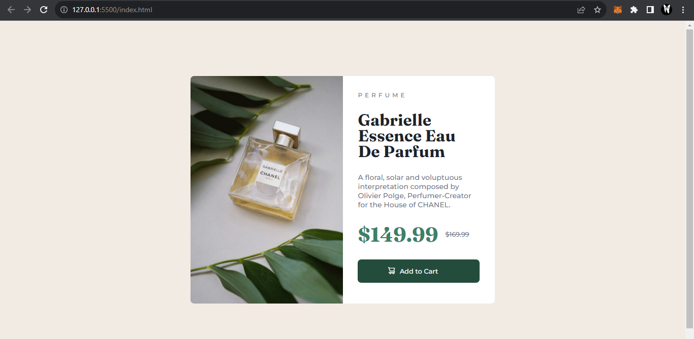

# Frontend Mentor - Product preview card component solution

This is a solution to the [Product preview card component challenge on Frontend Mentor](https://www.frontendmentor.io/challenges/product-preview-card-component-GO7UmttRfa). Frontend Mentor challenges help you improve your coding skills by building realistic projects. 

## Table of contents

## Overview

### The challenge

Users should be able to:

- View the optimal layout depending on their device's screen size
- See hover and focus states for interactive elements

### Screenshot

   

### Links

- Solution URL: [Add solution URL here](https://github.com/Tee-Ds/Product-preview-card.git)
- Live Site URL: [Add live site URL here]( https://tee-ds.github.io/Product-preview-card/)

## My process

### Built with

- Flexbox
- Basic Html & CSS
### Useful resources

- [Example resource 1](https://www.example.com) - This helped me for XYZ reason. I really liked this pattern and will use it going forward.
- [Example resource 2](https://www.example.com) - This is an amazing article which helped me finally understand XYZ. I'd recommend it to anyone still learning this concept.

**Note: Delete this note and replace the list above with resources that helped you during the challenge. These could come in handy for anyone viewing your solution or for yourself when you look back on this project in the future.**

## Author

- Frontend Mentor - [@Tee-Ds](https://www.frontendmentor.io/profile/Tee-Ds)
- GitHub - [@Tee-Ds](https://www.twitter.com/Tee-Ds)

